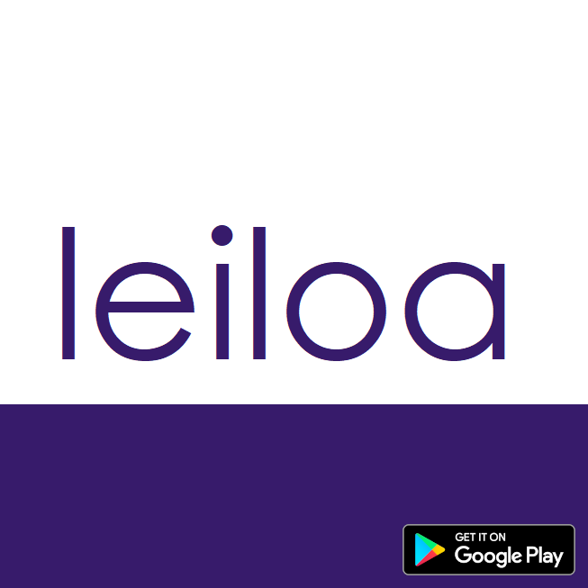
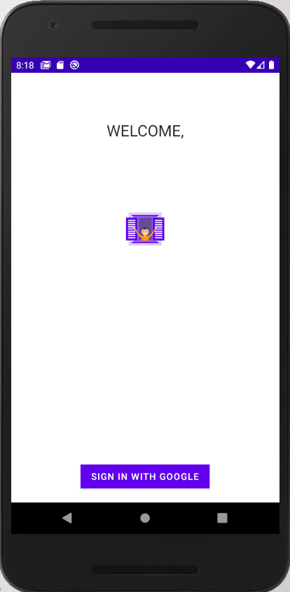
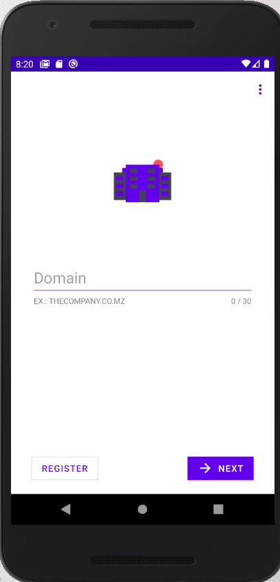
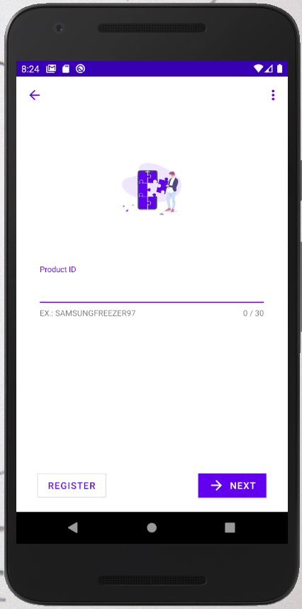
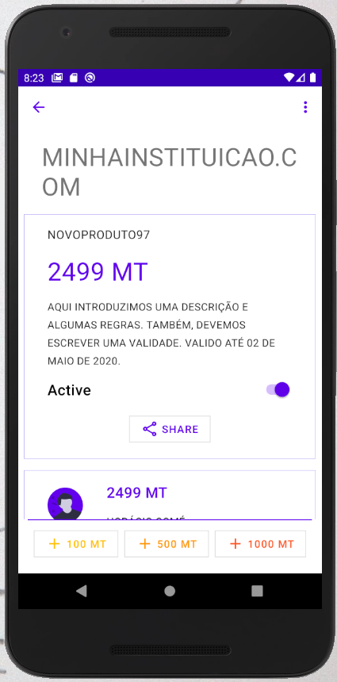

# leiloa

leiloa é um aplicativo nativo android, destinado a gerir o processo de concorrência a leilões.

Com ele é possível iniciar um leilão e participar em um leilão.

Os leilões no leiloa são totalmente privados e apenas aqueles com quem o proprietário partilha os dados do leilão podem aceder a determinado leilão.

_Não se esqueça de rever a nossa [Política de privacidade](https://github.com/horaciocome1/leiloa/blob/master/POLICY.md) e os [Termos e condições](https://github.com/horaciocome1/leiloa/blob/master/TERMS.md)._

## Por que experimentar?
Hoje em dia, leilões públicos são feitos de diversas maneiras dispendiosas. Em salas climatizadas, em urnas localizadas em pontos distantes, e outras. Participar em um leilão público também é complicado porque acareta custos de deslocação, e em alguns casos não se tem a oportunidade de aumentar o preço que estamos dispostos a pagar.

Com o leiloa é bem diferente. Apenas o vencedor precisa se deslocar para levantar o produto. Isto elimina imensos custos de operação. E por ser transparente, os participantes tem a chance de lutar pelo produto, pagando mais se desejarem. (Em urnas fechadas isto não é possível)

A baixo seguem-se outras vantagens.

### Privacidade
Para uma pessoa participar de um leilão, ou saber sequer da existência dele, precisa primeiro receber do organizador os dados do leilão.

### Amigo do ambiente
Participar em um leilão virtual, economiza centenas de gastos em combustivés fósseis gastos com o deslocamento de todos os participantes e gastos relacionados com a manutenção da sala de reunião.

### Baseado na núvem
Hoje é dia, recursos baseados em Cloud tem ganhado imensa popularidade por causa de suas extensivas vantagens. O leiloa tira proveito dessas vantagens para garantir que seus dados se mantêm intatos e sempre disponíveis.

### Fácilidade de uso
"Tecnologia é para os mais novos" - ouvimos isto com frequência. O leiloa é bem diferente. E testes mostram que pessoas mais velhas conseguem se familiarizar em poucos minutos com o leiloa. Isso se deve a simplicidade.

### Segurança
Todos os participantes no leiloa são autenticados e os dados são encriptados o que garante que não exista fuga de informação. E que qualquer fuga possa ser rastreada.

### Tranparência
Os participantes podem ver quem vai ganhar e podem tentar super a oferta desse, de modo que não ficam a pensar que o leilão foi viciado.

Estes foram alguns pontos que podem levá-lo a desejar instalar o aplicativos. Então, como fazê-lo?

## Instalar

Em breve, a app estará disponivel na PlayStore. Por enquanto, pode baixar a última versão do APK [aqui](https://github.com/horaciocome1/leiloa/releases).

## Como utilizar?

leiloa consiste em dois dados básicos: o domínio da empresa e um identificador de produto.

Quem organiza um leilão irá partilhar consigo estes dois dados. Insira no aplicativo para ter acesso ao leilão.

Organizar um leilão é igualmente simples. Apenas precisa registrar um domínio da empresa e registrar o produto que pretende leiloar, juntamente com um preço inicial e um texto com termos e condições a serem aplicadas.

Veja também a [playlist](https://www.youtube.com/playlist?list=PLaFVfHhJtDO5_cLo-IgxJv6mUR5_1WLIt) no YouTube.

## Contribuindo
Pull requests são sempre bem vindos. Para alterações grandes, por favor abra um issue primeiro.

Visite os ficheiros gradle para se informar sobre as versões. Tente replicar o ambiente de back end firebase para testes. Ou submeta as fingerprints da sua estação de trabalho para que seja possível conetar seus builds ao back end original.

Por favor, não se esqueça de realizar os testes apropriados.

## Autores e reconhecimento
O projeto foi concebido e desenvolvido por [Horácio Comé](http://horaciocome1.github.io/). No entanto, este projeto faz parte de um série de projetos leves open sourse em colaboração com [Ergito Rubildo](https://realrgt.github.io/rgt_website). Este projetos visam resolver, através de software e tecnologia, problemas simples da vida diária.

Quero dar um agradecimento especial ao [Dário Mungói](https://github.com/realdm). Ele é o responsável por agora ser possível publicar a app na Play Store!

## License
[Apache License 2.0](https://github.com/horaciocome1/leiloa/blob/master/LICENSE)

## Screenshots
   
